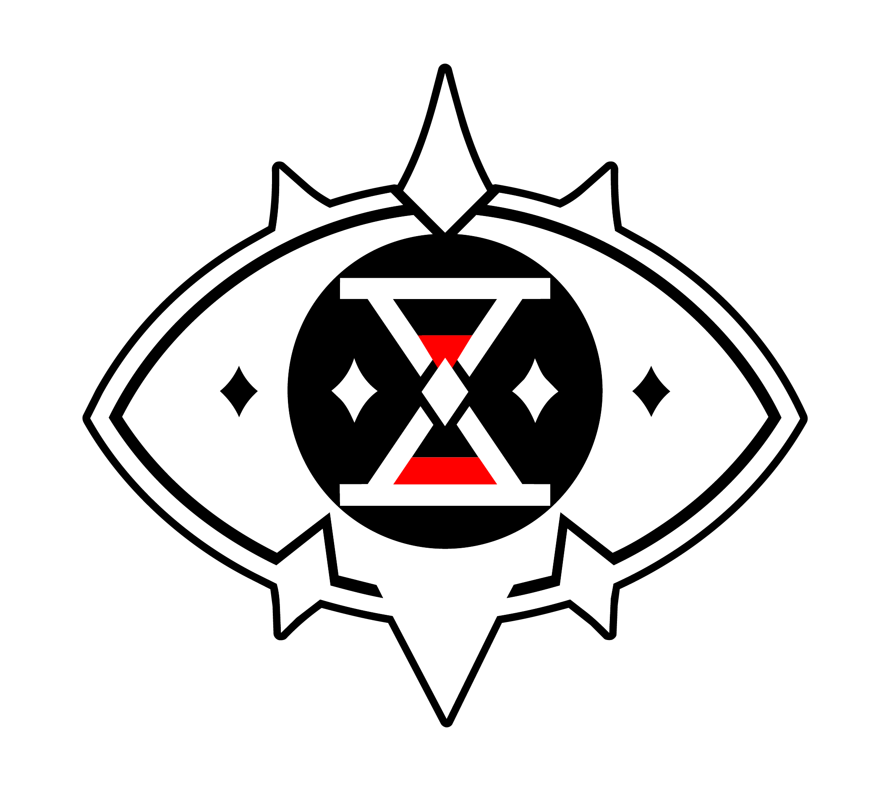

  <picture>
    <source media="(prefers-color-scheme: dark)" srcset="assets/img/logo-dark.png">
    
  </picture>

# GSGW Reader

A free, unofficial fan reader for the webnovel **Got Dropped Into A Ghost Story, Still Gotta Work** (GSGW).

**Read it online: <https://gsgw-reader.pages.dev/>**

---

This is a community-run, non-commercial home for reading *Got Dropped Into A Ghost Story, Still Gotta Work* — built by fans, for fans. Chapters are presented in a clean, distraction-free reader designed to make the work easier to enjoy and discuss.

## Features

- **Distraction-free reader** with multiple themes
- **Per-paragraph comments** so you can react and discuss as you read
- **Reading-progress tracking** to pick up where you left off
- **EPUB downloads** for offline reading

## Contributing

Spotted a typo or want to help polish a translation? The reader and its tooling are open source — open an issue or PR here, or say hi on [Discord](https://discord.gg/AXecqz9yR).

## Disclaimer

We're not affiliated with the original author or publisher. All rights to the story belong to its creator; this project exists purely to make the work easier to enjoy and discuss. If you can support the official release, please do.
